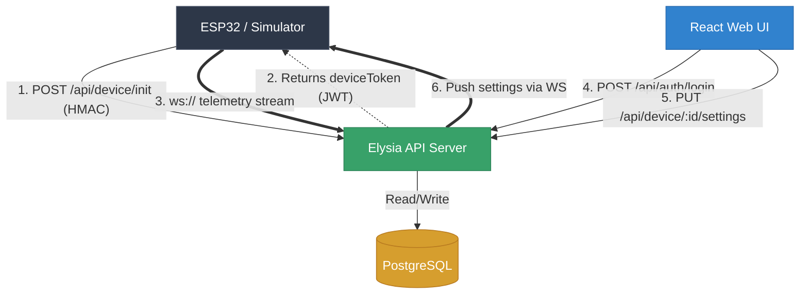

# Elycubator IoT Platform

An enterprise-grade, real-time IoT platform for smart egg incubators. This monorepo contains the complete software stack: hardware simulator, backend API, web dashboard, and database layer.

> **Note**: This system was architected to avoid bloated infrastructure (external MQTT brokers, message queues) by utilizing native high-performance WebSockets directly in the API layer. See [ADR.md](./ADR.md) for the full decision record.

---

## Table of Contents

- [System Architecture](#system-architecture)
- [Database Schema](#database-schema)
- [Security and Authentication](#security-and-authentication)
- [API Reference](#api-reference)
  - [Authentication](#authentication-endpoints)
  - [Device Management](#device-management-endpoints)
  - [WebSocket Streaming](#websocket-streaming)
- [Environment Variables](#environment-variables)
- [Local Development](#local-development)
- [Production Deployment](#production-deployment)
- [ESP32 Hardware Integration](#esp32-hardware-integration)

---

## System Architecture

Elycubator is built on a modern TypeScript/Bun stack organized as a monorepo:

| Component | Path | Technology | Role |
|-----------|------|------------|------|
| Backend API | `apps/api` | ElysiaJS + Bun | REST provisioning, WebSocket multiplexing, Prisma ORM |
| Web Dashboard | `apps/web` | React + Vite + Mantine | Real-time visualization, settings management |
| Hardware Simulator | `apps/simulator` | Bun (native WebSocket client) | Simulates ESP32 telemetry streams |
| Database | docker `db` service | PostgreSQL 15 | Persistent storage for users, devices, telemetry |
| Reverse Proxy | docker `caddy` service | Caddy 2.7 | TLS termination, path-based routing |
| Tunnel | docker `cloudflared` service | cloudflared | Zero-trust ingress without open firewall ports |

### Data Flow



---

## Database Schema

Four core models managed by Prisma ORM:

### User
| Column | Type | Constraints | Description |
|--------|------|-------------|-------------|
| `id` | `UUID` | PK, auto-generated | Unique user identifier |
| `email` | `String` | Unique | Login email address |
| `name` | `String?` | Optional | Display name |
| `passwordHash` | `String` | Required | Argon2id hash |
| `refreshToken` | `String?` | Optional | Hashed refresh token for session rotation |
| `createdAt` | `DateTime` | Auto | Account creation timestamp |
| `updatedAt` | `DateTime` | Auto | Last modification timestamp |

### Device
| Column | Type | Constraints | Description |
|--------|------|-------------|-------------|
| `id` | `UUID` | PK, auto-generated | Unique device identifier |
| `macAddress` | `String` | Unique | Hardware MAC address (e.g. `AA:BB:CC:DD:EE:01`) |
| `pairingCode` | `String?` | Unique, nullable | 6-digit PIN shown on device screen during setup |
| `isClaimed` | `Boolean` | Default: `false` | Whether a user has claimed ownership |
| `deviceSecret` | `String` | Required | HMAC shared secret (unique per device in production) |
| `deviceToken` | `String?` | Optional | Currently active JWT session token |
| `nickname` | `String?` | Optional | User-assigned friendly name |
| `userId` | `UUID?` | FK -> User | Owner reference |

### Settings (1:1 with Device)
| Column | Type | Default | Description |
|--------|------|---------|-------------|
| `targetTemp` | `Float` | `37.5` | Target incubation temperature in Celsius |
| `targetHumidity` | `Float` | `55.0` | Target relative humidity percentage |
| `tempKp` | `Float` | `2.0` | PID proportional gain (temperature) |
| `tempKi` | `Float` | `0.5` | PID integral gain (temperature) |
| `tempKd` | `Float` | `1.0` | PID derivative gain (temperature) |
| `humidKp` | `Float` | `1.5` | PID proportional gain (humidity) |
| `humidKi` | `Float` | `0.3` | PID integral gain (humidity) |
| `humidKd` | `Float` | `0.5` | PID derivative gain (humidity) |
| `turnIntervalHrs` | `Int` | `4` | Hours between automatic egg turns (0 = disabled) |
| `turnAngle` | `Int` | `90` | Servo turn angle in degrees |
| `servoTrigger` | `Boolean` | `false` | One-shot flag: triggers immediate turn, auto-resets |
| `lampEnabled` | `Boolean` | `true` | Master heating lamp switch |
| `fanEnabled` | `Boolean` | `true` | Master ventilation fan switch |

### Telemetry (1:N with Device)
| Column | Type | Description |
|--------|------|-------------|
| `temperature` | `Float?` | Measured temperature in Celsius |
| `humidity` | `Float?` | Measured relative humidity percentage |
| `lampDuty` | `Float?` | Heating lamp duty cycle (0-100%) |
| `fanDuty` | `Float?` | Fan duty cycle (0-100%) |
| `servoAngle` | `Float?` | Current servo position in degrees |
| `timestamp` | `DateTime` | Reading timestamp (auto-generated) |

---

## Security and Authentication

Elycubator uses a strict dual-layer authentication strategy. Users and devices are authenticated through completely separate mechanisms.

### Layer 1: User Authentication (Argon2id + JWT)

1. User submits `email` + `password` to `POST /api/auth/login`.
2. Server verifies password against the stored Argon2id hash using `Bun.password.verify()`.
3. On success, server returns a short-lived **access token** (default: 15 minutes) and sets an HTTP-only **refresh token** cookie (default: 7 days, path-scoped to `/api/auth`).
4. The access token is a signed JWT containing `{ sub: userId, email, type: "user" }`.
5. All protected endpoints use the `requireUser` middleware, which extracts and verifies the Bearer token from the `Authorization` header.
6. When the access token expires, the client calls `POST /api/auth/refresh`. The server verifies the cookie against the hashed refresh token stored in the database and issues a new access token.

### Layer 2: Device Provisioning (HMAC-SHA256 + JWT)

1. Each ESP32 is flashed with a factory `DEVICE_SECRET` and knows its own `MAC_ADDRESS`.
2. On boot, the device computes `HMAC-SHA256(MAC_ADDRESS + ":" + PAIRING_PIN, DEVICE_SECRET)`.
3. Device sends `POST /api/device/init` with `{ macAddress, pairingPin, hmacSignature }`.
4. Server independently computes the same HMAC. If they match, the device is trusted.
5. Server issues a long-lived **device token** (default: 30 days) containing `{ sub: deviceId, macAddress, type: "device" }`.
6. Device uses this token as a query parameter to establish the persistent WebSocket connection.

---

## API Reference

**Base URL**: `http://localhost:3000` (development) or proxied via Caddy at `/api/*` (production).

All responses follow a consistent envelope:

```json
// Success
{ "success": true, "data": { ... } }

// or with message
{ "success": true, "message": "..." }

// Error
{ "success": false, "error": "Human-readable error message." }
```

### Authentication Endpoints

#### POST /api/auth/register

Creates a new user account.

| | |
|---|---|
| **Auth** | None |
| **Content-Type** | `application/json` |

**Request Body**:
```json
{
  "email": "user@example.com",
  "password": "minimum8chars",
  "name": "Optional Display Name"
}
```

| Field | Type | Required | Validation |
|-------|------|----------|------------|
| `email` | `string` | Yes | Must be valid email format |
| `password` | `string` | Yes | Minimum 8 characters |
| `name` | `string` | No | Display name |

**Success Response** `200`:
```json
{
  "success": true,
  "message": "Account created successfully.",
  "data": {
    "id": "a1b2c3d4-...",
    "email": "user@example.com",
    "name": "Optional Display Name"
  }
}
```

**Error Response** `409`:
```json
{ "success": false, "error": "Email is already registered." }
```

---

#### POST /api/auth/login

Authenticates a user and returns an access token. Sets an HTTP-only refresh cookie.

| | |
|---|---|
| **Auth** | None |
| **Content-Type** | `application/json` |

**Request Body**:
```json
{
  "email": "mai@elycubator.local",
  "password": "seed-password-123"
}
```

**Success Response** `200`:
```json
{
  "success": true,
  "data": {
    "accessToken": "eyJhbGciOiJIUzI1NiIs...",
    "user": {
      "id": "a1b2c3d4-...",
      "email": "mai@elycubator.local",
      "name": "Mai"
    }
  }
}
```

**Error Response** `401`:
```json
{ "success": false, "error": "Invalid credentials." }
```

**Side Effects**:
- Sets `refresh_token` HTTP-only cookie (path: `/api/auth`, maxAge: 7 days).
- Stores hashed refresh token in the User record.

---

#### POST /api/auth/refresh

Issues a new access token using the HTTP-only refresh cookie. No request body needed.

| | |
|---|---|
| **Auth** | Requires `refresh_token` cookie |
| **Content-Type** | None |

**Success Response** `200`:
```json
{ "success": true, "data": { "accessToken": "eyJhbGciOiJIUzI1NiIs..." } }
```

**Error Response** `401`:
```json
{ "success": false, "error": "No refresh token provided." }
{ "success": false, "error": "Session not found." }
{ "success": false, "error": "Invalid refresh token." }
```

---

#### POST /api/auth/logout

Invalidates the current session. Clears the refresh cookie and nullifies the stored hash.

| | |
|---|---|
| **Auth** | Requires `refresh_token` cookie |

**Success Response** `200`:
```json
{ "success": true, "message": "Logged out." }
```

---

#### GET /api/auth/me

Returns the current authenticated user profile and their list of claimed devices.

| | |
|---|---|
| **Auth** | `Authorization: Bearer <accessToken>` |

**Success Response** `200`:
```json
{
  "success": true,
  "data": {
    "id": "a1b2c3d4-...",
    "email": "mai@elycubator.local",
    "name": "Mai",
    "devices": [
      {
        "id": "fcece549-...",
        "macAddress": "AA:BB:CC:DD:EE:01",
        "nickname": "Incubator Alpha",
        "isClaimed": true,
        "createdAt": "2026-06-17T08:38:31.419Z"
      }
    ]
  }
}
```

**Error Responses**:
- `401`: `"Missing authorization token."` or `"Invalid or expired token."`
- `404`: `"User not found."`

---

### Device Management Endpoints

#### POST /api/device/init

Called by the ESP32 hardware on boot. Verifies the device HMAC signature and issues a session JWT.

| | |
|---|---|
| **Auth** | None (HMAC-verified) |
| **Content-Type** | `application/json` |

**Request Body**:
```json
{
  "macAddress": "AA:BB:CC:DD:EE:02",
  "pairingPin": "123456",
  "hmacSignature": "a9f3c8e1b2d4..."
}
```

| Field | Type | Required | Description |
|-------|------|----------|-------------|
| `macAddress` | `string` | Yes | Device hardware MAC address |
| `pairingPin` | `string` | Yes | 6-digit pairing code shown on device screen |
| `hmacSignature` | `string` | Yes | `HMAC-SHA256(macAddress + ":" + pairingPin, DEVICE_SECRET)` as hex |

**Success Response (new device)** `200`:
```json
{
  "success": true,
  "deviceId": "fcece549-...",
  "claimed": false,
  "deviceToken": "eyJhbGciOiJIUzI1NiIs...",
  "message": "Device registered and awaiting claim."
}
```

**Success Response (already claimed)** `200`:
```json
{
  "success": true,
  "deviceId": "fcece549-...",
  "claimed": true,
  "deviceToken": "eyJhbGciOiJIUzI1NiIs...",
  "message": "Device already claimed. New session token issued."
}
```

**Error Response** `401`:
```json
{ "success": false, "error": "HMAC signature verification failed." }
```

---

#### POST /api/device/claim

Claims an unclaimed device to the authenticated user's account. Creates default Settings if none exist.

| | |
|---|---|
| **Auth** | `Authorization: Bearer <accessToken>` |
| **Content-Type** | `application/json` |

**Request Body**:
```json
{
  "macAddress": "AA:BB:CC:DD:EE:04",
  "pairingPin": "123456",
  "nickname": "My Incubator"
}
```

| Field | Type | Required | Description |
|-------|------|----------|-------------|
| `macAddress` | `string` | Yes | MAC address of device to claim |
| `pairingPin` | `string` | Yes | Must match the code on the device |
| `nickname` | `string` | Yes | User-assigned friendly name |

**Success Response** `200`:
```json
{ "success": true, "message": "Device successfully claimed!" }
```

**Error Responses**:
- `404`: `"Device not found. Ensure it is connected to the internet first."`
- `400`: `"Device is already claimed."`
- `401`: `"Invalid Pairing PIN."`

**Side Effects**:
- Sets `isClaimed = true`, clears `pairingCode`, assigns `userId` and `nickname`.
- Creates a default `Settings` record with standard incubation parameters (37.5 C, 55% humidity).

---

#### GET /api/device/:deviceId/settings

Fetches the full PID configuration and target parameters for a device.

| | |
|---|---|
| **Auth** | `Authorization: Bearer <accessToken>` |
| **URL Params** | `deviceId` - UUID of the device |

**Success Response** `200`:
```json
{
  "success": true,
  "data": {
    "id": "0cf1dd34-...",
    "deviceId": "fcece549-...",
    "targetTemp": 37.5,
    "targetHumidity": 55.0,
    "tempKp": 2.0,
    "tempKi": 0.5,
    "tempKd": 1.0,
    "humidKp": 1.5,
    "humidKi": 0.3,
    "humidKd": 0.5,
    "turnIntervalHrs": 4,
    "turnAngle": 90,
    "servoTrigger": false,
    "lampEnabled": true,
    "fanEnabled": true,
    "updatedAt": "2026-06-17T08:38:31.419Z"
  }
}
```

**Error Response** `404`:
```json
{ "success": false, "error": "Settings not found for this device." }
```

---

#### PUT /api/device/:deviceId/settings

Updates one or more settings fields. All fields are optional (partial update). After persisting to the database, the server **immediately pushes** the full updated settings object to the device via its active WebSocket connection.

| | |
|---|---|
| **Auth** | `Authorization: Bearer <accessToken>` |
| **URL Params** | `deviceId` - UUID of the device |
| **Content-Type** | `application/json` |

**Request Body** (all fields optional):
```json
{
  "targetTemp": 38.0,
  "targetHumidity": 60.0,
  "tempKp": 2.5,
  "tempKi": 0.6,
  "tempKd": 1.2,
  "humidKp": 1.8,
  "humidKi": 0.4,
  "humidKd": 0.6,
  "turnIntervalHrs": 2,
  "turnAngle": 45,
  "servoTrigger": false,
  "lampEnabled": true,
  "fanEnabled": true
}
```

| Field | Type | Description |
|-------|------|-------------|
| `targetTemp` | `number` | Target temperature (Celsius) |
| `targetHumidity` | `number` | Target humidity (%) |
| `tempKp` | `number` | Temperature PID proportional gain |
| `tempKi` | `number` | Temperature PID integral gain |
| `tempKd` | `number` | Temperature PID derivative gain |
| `humidKp` | `number` | Humidity PID proportional gain |
| `humidKi` | `number` | Humidity PID integral gain |
| `humidKd` | `number` | Humidity PID derivative gain |
| `turnIntervalHrs` | `number` | Auto-turn interval in hours (0 = disabled) |
| `turnAngle` | `number` | Servo angle in degrees |
| `servoTrigger` | `boolean` | Set `true` to trigger immediate turn |
| `lampEnabled` | `boolean` | Master lamp switch |
| `fanEnabled` | `boolean` | Master fan switch |

**Success Response** `200`:
```json
{
  "success": true,
  "data": { "...full settings object..." }
}
```

**Side Effects**:
- Persists changes to PostgreSQL.
- Calls `pushDeviceSettings(deviceId, settings)` which looks up the in-memory WebSocket map and sends `{ type: "SETTINGS_UPDATE", payload: settings }` to the connected device with zero latency.

---

#### POST /api/device/:deviceId/servo/trigger

Manually triggers the egg-turning servo motor. Sets `servoTrigger = true` in the database and pushes the update to the device immediately via WebSocket.

| | |
|---|---|
| **Auth** | `Authorization: Bearer <accessToken>` |
| **URL Params** | `deviceId` - UUID of the device |

**Success Response** `200`:
```json
{ "success": true, "message": "Servo turn triggered." }
```

**Error Response** `404`:
```json
{ "success": false, "error": "Settings not found." }
```

**Side Effects**:
- Identical WebSocket push mechanism as `PUT /settings`.
- The ESP32 firmware is expected to read `servoTrigger: true`, execute the turn, then the next telemetry cycle resets the flag.

---

### WebSocket Streaming

**Endpoint**: `ws://<SERVER>/api/device/stream?token=<DEVICE_TOKEN>`

This is a persistent, bidirectional WebSocket used exclusively by ESP32 hardware or the simulator. It is NOT used by the web frontend.

#### Connection Lifecycle

1. **Handshake**: Device connects with its JWT as a query parameter.
2. **Authentication**: Server verifies the JWT type is `"device"` and confirms the token matches the one stored in the database (prevents use of revoked tokens).
3. **Registration**: Server stores the WebSocket reference in an in-memory `Map<deviceId, WebSocket>` for instant push capability.
4. **Initial Settings Push**: Immediately after connection, the server sends the current `Settings` object so the device is always in sync.
5. **Streaming Phase**: The connection stays open indefinitely. Device sends telemetry upstream; server pushes settings downstream.
6. **Disconnection**: On close, the server removes the device from the active map and logs the event.

#### Upstream (Device -> Server)

Device sends JSON text frames at a regular interval (default: every 2 seconds):

```json
{
  "temperature": 37.52,
  "humidity": 54.8,
  "lampDuty": 12.5,
  "fanDuty": 0.0,
  "servoAngle": 0
}
```

| Field | Type | Unit | Description |
|-------|------|------|-------------|
| `temperature` | `number` | Celsius | Current measured temperature |
| `humidity` | `number` | % RH | Current measured relative humidity |
| `lampDuty` | `number` | % (0-100) | Heating lamp PWM duty cycle |
| `fanDuty` | `number` | % (0-100) | Fan PWM duty cycle |
| `servoAngle` | `number` | Degrees | Current servo arm position |

Each frame is persisted as a new row in the `Telemetry` table.

#### Downstream (Server -> Device)

Pushed whenever a user updates settings via the REST API:

```json
{
  "type": "SETTINGS_UPDATE",
  "payload": {
    "id": "0cf1dd34-...",
    "deviceId": "fcece549-...",
    "targetTemp": 37.5,
    "targetHumidity": 55.0,
    "tempKp": 2.0,
    "tempKi": 0.5,
    "tempKd": 1.0,
    "humidKp": 1.5,
    "humidKi": 0.3,
    "humidKd": 0.5,
    "turnIntervalHrs": 4,
    "turnAngle": 90,
    "servoTrigger": false,
    "lampEnabled": true,
    "fanEnabled": true,
    "updatedAt": "2026-06-17T08:38:31.419Z"
  }
}
```

#### Error Frames

If authentication fails during the handshake, the server sends an error and closes the socket:

```json
{ "error": "Invalid device token." }
{ "error": "Device token revoked." }
{ "error": "Authentication failed." }
```

---

## Environment Variables

Copy `.env.example` to `.env` and configure all values before running.

| Variable | Required | Default | Description |
|----------|----------|---------|-------------|
| `DB_PASSWORD` | Yes | `postgres` | PostgreSQL password |
| `DATABASE_URL` | Yes (API) | Composed from `DB_PASSWORD` | Full Postgres connection string |
| `JWT_SECRET` | Yes | - | HMAC signing key for JWTs. Generate with `openssl rand -hex 64` |
| `JWT_EXPIRES_IN` | No | `15m` | Access token lifetime (e.g. `15m`, `1h`) |
| `REFRESH_TOKEN_EXPIRES_IN` | No | `7d` | Refresh token lifetime |
| `DEVICE_TOKEN_EXPIRES_IN` | No | `30d` | Device session token lifetime |
| `DEVICE_SECRET` | Yes | - | Shared HMAC secret for device verification. In production, each device gets a unique secret burned at factory time |
| `CLOUDFLARE_TUNNEL_TOKEN` | No | - | Only needed if using Cloudflare Tunnel for ingress |

---

## Local Development

### Prerequisites

- [Bun](https://bun.sh/) v1.0+
- Docker and Docker Compose (for PostgreSQL)

### 1. Clone and Configure

```bash
git clone <repo-url>
cd inkubator-iot
cp .env.example .env
# Edit .env with your preferred passwords and secrets
```

### 2. Database Setup

```bash
# Start PostgreSQL container
docker-compose up db -d

# Generate Prisma client and push schema
cd apps/api
bunx prisma generate
bunx prisma db push

# Seed demo data (creates user + 4 devices + 200 telemetry readings)
bun run db:seed
```

The seed script creates the following test data:

| Entity | Details |
|--------|---------|
| User | `mai@elycubator.local` / `seed-password-123` |
| Device 1 | "Incubator Alpha" - stable profile, 100 readings |
| Device 2 | "Hatcher Beta" - struggling profile (runs hot/humid), 100 readings |
| Device 3 | "Storage Unit" - offline, 0 readings |
| Device 4 | Unclaimed device, MAC `AA:BB:CC:DD:EE:04`, PIN `123456` |

### 3. Run the Full Stack

Open three terminals:

```bash
# Terminal 1: API server (port 3000)
cd apps/api
bun run dev

# Terminal 2: Web UI (port 5173)
cd apps/web
bun run dev

# Terminal 3: Hardware Simulator (connects as "Hatcher Beta")
cd apps/simulator
bun run start
```

The simulator will automatically:
1. Register with the API using HMAC authentication.
2. Open a WebSocket connection.
3. Receive current settings.
4. Stream simulated telemetry every 2 seconds.

---

## Production Deployment

### Container Architecture

The `docker-compose.yml` orchestrates five services on a shared Docker network:

```
Internet -> Cloudflare Tunnel -> cloudflared -> caddy:80
                                                  |
                                        +---------+---------+
                                        |                   |
                                   /api/* -> api:3000   /* -> web:80
                                                  |
                                              db:5432
```

Caddy natively proxies WebSocket connections without any additional configuration.

### Deploy from GitHub Container Registry

```bash
docker-compose pull
docker-compose up -d
```

### Deploy from Local Source

```bash
docker-compose -p elycubator -f docker-compose.yml -f <(cat <<EOF
version: '3.8'
services:
  api:
    build: ./apps/api
  web:
    build: ./apps/web
EOF
) up -d --build
```

> **Warning**: Always use the `-p elycubator` project flag when running custom compose overrides. Without it, Docker may create duplicate containers that clash on port 80.

### Rollback

If a deployment fails, your remote `ghcr.io` images remain at the last stable tag:

```bash
docker-compose down
docker-compose up -d
```

---

## ESP32 Hardware Integration

Step-by-step guide for writing C/C++ firmware that communicates with this backend.

### 1. Compute HMAC Signature

Using `mbedtls` (available in ESP-IDF) or an Arduino crypto library:

```c
// Pseudocode
char data[64];
snprintf(data, sizeof(data), "%s:%s", MAC_ADDRESS, PAIRING_PIN);
hmac_sha256(DEVICE_SECRET, data, output_hex);
```

### 2. Bootstrap via HTTP

```
POST http://<SERVER>/api/device/init
Content-Type: application/json

{
  "macAddress": "AA:BB:CC:DD:EE:01",
  "pairingPin": "482911",
  "hmacSignature": "<hex output from step 1>"
}
```

Extract `deviceToken` from the JSON response body.

### 3. Connect WebSocket

```
ws://<SERVER>/api/device/stream?token=<deviceToken>
```

### 4. Handle Incoming Messages

Listen for text frames. Parse JSON and check for `type: "SETTINGS_UPDATE"`:

```json
{
  "type": "SETTINGS_UPDATE",
  "payload": {
    "targetTemp": 37.5,
    "targetHumidity": 55.0,
    "servoTrigger": true,
    ...
  }
}
```

Update PID setpoints immediately. If `servoTrigger` is `true`, execute the egg turn.

### 5. Stream Telemetry

Send a JSON text frame every 2 seconds (configurable):

```json
{
  "temperature": 37.52,
  "humidity": 54.8,
  "lampDuty": 12.5,
  "fanDuty": 0.0,
  "servoAngle": 0
}
```

Do **not** close the WebSocket connection. If disconnected, implement exponential backoff reconnection starting at 5 seconds.
